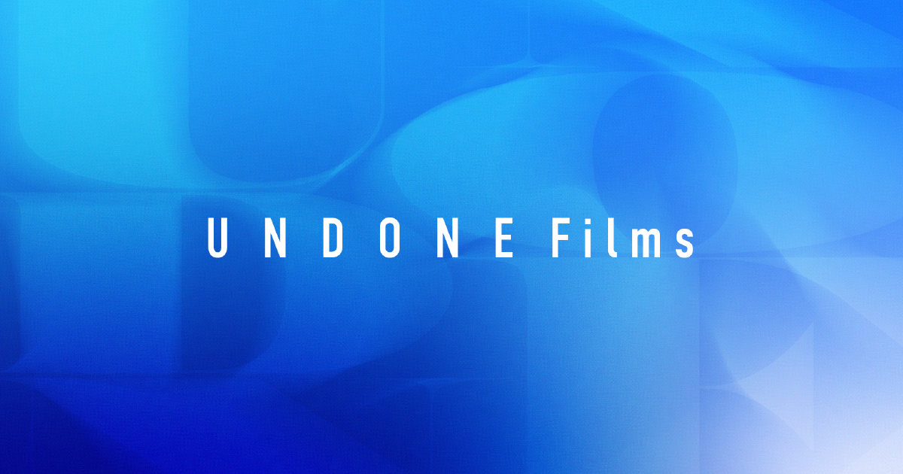

<p align="center">
  
</p>

<h1 align="center">Undone Official Website</h1>

<p align="center">
  <strong>こころを動かすストーリーをつくる映像制作パートナー</strong>
</p>

<p align="center">
  <a href="https://undone.jp">
    
  </a>
  <a href="LICENSE">
    
  </a>
  <a href="https://pages.cloudflare.com/">
    
  </a>
</p>

---

## About

**Undone（合同会社Undone）** は、企画・脚本・撮影・編集まで一貫して行う映像制作チームです。

エンタメ・企業・教育・公的機関まで幅広く対応し、目的に沿った最適な映像体験をデザインします。

## Tech Stack

| Category | Technology |
|----------|------------|
| Frontend | HTML5, CSS3, Vanilla JavaScript |
| Styling | CSS Variables, Flexbox, Grid |
| Library | jQuery 3.7.1, Slick Carousel (CDN) |
| Data | JSON |
| Hosting | Cloudflare Pages |
| API | Cloudflare Workers |

## Project Structure

```
undonejp/
├── index.html              # トップページ
├── about.html              # 会社概要
├── lineup.html             # 制作実績一覧
├── css/
│   ├── style.css           # メインスタイル
│   └── reset.css           # リセットCSS
├── js/
│   └── script.js           # メインスクリプト
├── assets/
│   └── data/
│       └── productions.json # 制作実績データ
├── container/              # 画像・動画アセット
└── functions/
    └── api/                # Cloudflare Workers
        ├── youtube.js      # YouTube API
        ├── tiktok.js       # TikTok oEmbed
        └── dmm-thumbnail.js # DMM サムネイル取得
```

## Local Development

```bash
# リポジトリをクローン
git clone https://github.com/akine/undonejp.git
cd undonejp

# ローカルサーバーを起動
python -m http.server 8000
```

ブラウザで http://localhost:8000 にアクセス

## How to Update

### 制作実績の追加

`assets/data/productions.json` を編集：

```json
{
  "title": "作品タイトル",
  "tag": "カテゴリ",
  "platform": "YouTube",
  "role": "担当内容",
  "thumbnail": "container/lineup/image.jpg",
  "url": "https://..."
}
```

### 画像の追加

`container/` 配下に配置

### スタイル・機能の変更

- レイアウト: `css/style.css`
- 動作: `js/script.js`

## Contact

<p>
  <a href="https://form.run/@undone-33ZwMm0JsvD5iTRwIpOS">
    
  </a>
  <a href="mailto:info@undone.jp">
    
  </a>
</p>

## License

- **コード** (HTML/CSS/JS/JSON): [MIT License](LICENSE)
- **制作物** (デザイン、ロゴ、画像、動画、文章): 著作権保護対象・無断利用禁止

---

<p align="center">
  <sub>© 2025 Undone LLC. All Rights Reserved.</sub>
</p>
